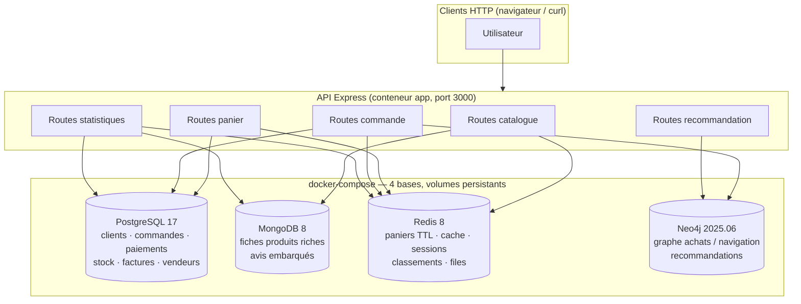
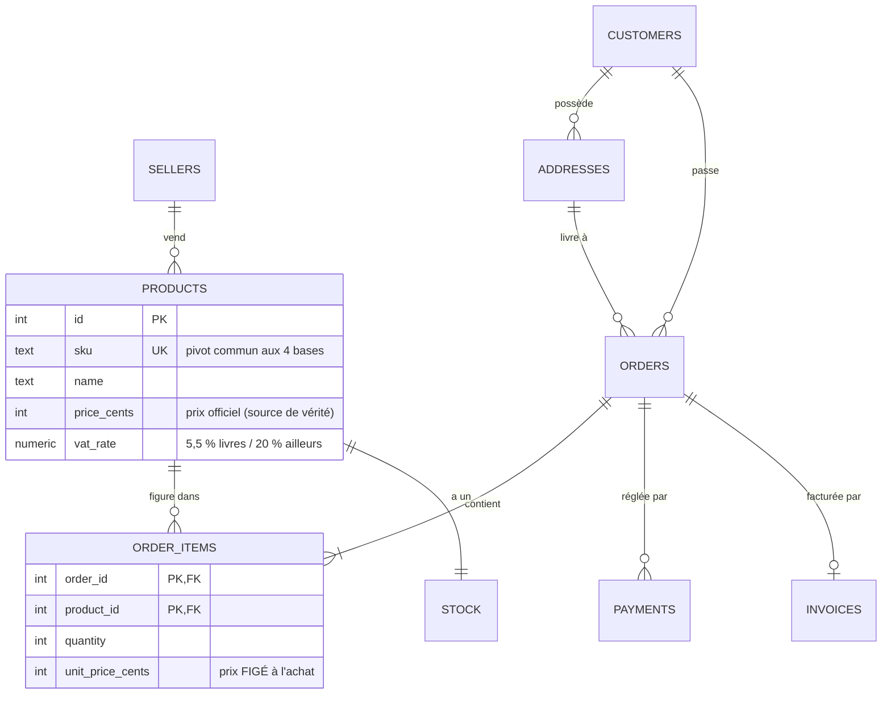
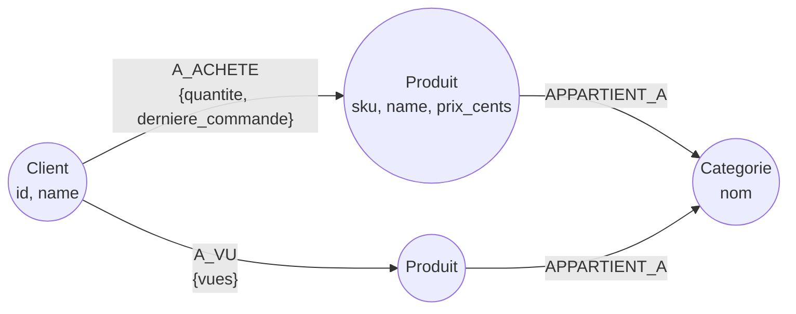

# Dossier de conception — Marketplace en persistance polyglotte

> Projet NoSQL B3 · Quatre bases (PostgreSQL, MongoDB, Redis, Neo4j) au service d'une marketplace e-commerce.
> L'application (API Express) n'est qu'un support : ce dossier porte sur **les choix de bases, la modélisation et la répartition des données**.

## Sommaire

1. [Contexte et architecture](#1-contexte-et-architecture)
2. [Modélisation par base](#2-modélisation-par-base)
3. [Tableau de répartition des données](#3-tableau-de-répartition-des-données)
4. [Requêtes représentatives](#4-requêtes-représentatives)
5. [Cohérence, redondances et compromis](#5-cohérence-redondances-et-compromis)
6. [Reproductibilité et jeu de données](#6-reproductibilité-et-jeu-de-données)
7. [Limites et évolutions possibles](#7-limites-et-évolutions-possibles)

---

## 1. Contexte et architecture

L'application est une **marketplace** (type Amazon / Cdiscount) : des vendeurs tiers
proposent des produits de catégories très différentes (high-tech, mode, livres,
maison…), les clients naviguent dans le catalogue, remplissent un panier, commandent,
et reçoivent des recommandations. Une interface web (« Panopli », servie sur
`http://localhost:3000`, non notée) permet de manipuler l'ensemble du parcours ;
chaque écran s'appuie sur la base adaptée, décrite ci-dessous.

Ce domaine se prête particulièrement bien à la persistance polyglotte parce qu'il
mélange **quatre natures de données irréconciliables dans un seul moteur** :

- des données **transactionnelles** où l'erreur est interdite (commande, paiement, stock) ;
- un **catalogue hétérogène** dont les attributs changent selon la catégorie ;
- des données **volatiles à très fort trafic** (paniers, sessions, compteurs, cache) ;
- des données **de relations** dont la valeur est dans les liens (qui achète quoi avec quoi).

### Schéma d'architecture



**Flux le plus représentatif — le passage de commande** (`POST /api/orders/:id`) :

```
Panier lu dans REDIS ──▶ Transaction POSTGRESQL (BEGIN…COMMIT)          ──▶ REDIS : panier supprimé,
   (Hash + TTL)             · verrouillage du stock (FOR UPDATE)             classement des ventes mis à jour,
                            · commande + lignes + paiement                   e-mail poussé dans la file
                            · tout passe ou rien ne passe             ──▶ NEO4J : relation (Client)-[:A_ACHETE]->(Produit)
```

---

## 2. Modélisation par base

### 2.1 PostgreSQL — le socle transactionnel

**Vocation** : tout ce qui touche à l'argent, au stock et à l'identité des personnes.
Ces données exigent l'intégrité référentielle, des contraintes fortes et des
transactions ACID — la spécialité du relationnel.



Justifications des choix :

- **Schéma normalisé (3FN)** : `addresses` est séparée de `customers` (un client a
  plusieurs adresses), `stock` est séparé de `products` (la ligne de stock est
  verrouillée seule avec `SELECT … FOR UPDATE` au checkout, sans bloquer la lecture
  du produit), `order_items` porte la clé composite `(order_id, product_id)`.
- **Prix en centimes (`INT`)** plutôt qu'en flottant : aucune erreur d'arrondi
  possible sur de l'argent.
- **`unit_price_cents` recopié dans `order_items`** : dénormalisation volontaire et
  classique — le prix payé est figé, l'historique reste juste même si le prix
  catalogue change ensuite.
- **Types `ENUM`** (`order_status`, `payment_method`…) : les états invalides sont
  rejetés par la base elle-même, pas seulement par l'application.
- **La table `products` est volontairement minimale** (identité, prix officiel, TVA,
  vendeur) : c'est le pivot référentiel. La fiche descriptive vit dans MongoDB
  (voir § 2.2 et § 5).
- **Index** sur les chemins d'accès réels : `orders(customer_id)`, `orders(ordered_at)`,
  `order_items(product_id)`, `products(category)`.

### 2.2 MongoDB — le catalogue hétérogène

**Vocation** : la fiche produit riche. Une marketplace vend des objets qui n'ont
**aucun attribut en commun** : un PC a un processeur et de la RAM, un jean a des
tailles, un livre a un ISBN. En SQL, il faudrait soit une table à 200 colonnes
presque toutes NULL, soit un modèle EAV (Entity-Attribute-Value) illisible et lent.
En document, chaque fiche embarque exactement les champs qui la concernent.

Exemple réel de deux documents de la collection `products` :

```js
// Un PC portable…
{
  sku: "INFO-0002",                      // ← pivot commun avec PostgreSQL
  name: "PC portable gamer Raptor 15\" RTX",
  category: "informatique",
  price: 1499.0,                         // miroir d'affichage (voir § 5)
  specs: {                               // ← attributs SPÉCIFIQUES au produit
    processeur: "AMD Ryzen 7 7840HS",
    gpu: "NVIDIA RTX 4070 8 Go",
    ram: "32 Go DDR5",
    ecran: "15,6\" IPS QHD 165 Hz"
  },
  reviews: [                             // ← avis EMBARQUÉS (sous-documents)
    { author: "Léa B.", rating: 5, comment: "Parfait…", date: ISODate(…), verified: true }
  ],
  ratingAverage: 4.4, ratingCount: 7     // pré-calculés pour l'affichage liste
}

// … et un t-shirt : mêmes requêtes, structure totalement différente
{
  sku: "MODE-0001",
  name: "T-shirt coton bio unisexe",
  category: "mode",
  specs: { matiere: "100 % coton biologique", grammage: "180 g/m²" },
  variants: [ { taille: "M", couleur: "noir" }, { taille: "L", couleur: "blanc" }, … ],
  reviews: [ … ]
}
```

Choix **embedding vs referencing**, justifié cas par cas :

| Donnée | Choix | Pourquoi |
|---|---|---|
| `specs` | **embarqué** | toujours lu avec la fiche, jamais seul ; structure propre à chaque produit |
| `variants` (tailles/pointures) | **embarqué** | liste courte et bornée (< 10), affichée sur la fiche |
| `reviews` | **embarqué** | lus à 99 % avec la fiche produit (1 requête = 1 écran) ; volume borné à l'échelle du projet ; permet de pré-calculer `ratingAverage` dans le même document |
| commandes, stock, prix officiel | **référencé par `sku`** (vers PostgreSQL) | données transactionnelles : elles n'ont rien à faire dans un document catalogue |

*Recul* : si un produit accumulait des dizaines de milliers d'avis, on sortirait
`reviews` dans une collection dédiée référencée par `sku` (pattern *subset* : ne
garder que les 10 derniers dans la fiche). À notre échelle, l'embedding est le bon choix.

**Index orientés requêtes** : `{sku: 1}` unique (accès fiche), `{category: 1, price: 1}`
(navigation par rayon triée par prix), index **texte français** sur
`name + description + tags` (barre de recherche).

### 2.3 Redis — le volatile et le temps réel

**Vocation** : tout ce qui est éphémère, à très fort trafic, ou qui doit expirer
tout seul. Chaque structure Redis est choisie pour l'opération qu'elle rend O(1)
ou O(log n) :

| Clé | Structure | TTL | Usage et justification |
|---|---|---|---|
| `cart:{clientId}` | **Hash** (sku → quantité) | 48 h | le panier est modifié à chaque clic ; `HINCRBY` est atomique ; un panier abandonné **disparaît tout seul** — aucune purge à coder |
| `session:{token}` | **Hash** | 30 min | session utilisateur glissante, expirée automatiquement |
| `cache:product:{sku}` | **String** (JSON) | 10 min | cache-aside des fiches MongoDB : absorbe les lectures répétées du catalogue |
| `product:views:{sku}` | **String** compteur | — | `INCR` atomique à chaque consultation, sans transaction ni verrou |
| `ranking:bestsellers` | **Sorted Set** (score = ventes) | — | classement temps réel : `ZINCRBY` à chaque vente, top 10 en `ZREVRANGE` O(log n) — un `GROUP BY` SQL à chaque affichage serait absurde |
| `flashsale:{sku}` | **String** (JSON) | durée de l'offre | la vente flash **se termine d'elle-même** à l'expiration de la clé |
| `queue:emails` | **List** | — | file de jobs (confirmation de commande, relance panier) : `LPUSH` producteur / `RPOP` consommateur |

La persistance **AOF est activée** (`--appendonly yes`) : même « volatile », Redis
survit à un redémarrage — les TTL restants sont conservés.

### 2.4 Neo4j — le graphe des comportements d'achat

**Vocation** : les recommandations. La question « *les clients qui ont acheté X ont
aussi acheté quoi ?* » est une **traversée de relations à 2–3 sauts** : en SQL, ce
sont des auto-jointures multiples sur `order_items` qui explosent avec le volume ;
en graphe, c'est un parcours naturel de voisinage.



- **Nœuds** : `Client` (20), `Produit` (40), `Categorie` (7) — avec contraintes
  d'unicité (`sku`, `id`, `nom`).
- **Relations dirigées et portant des propriétés** :
  `(:Client)-[:A_ACHETE {quantite, derniere_commande}]->(:Produit)` — agrégat des
  **vraies commandes PostgreSQL** (le seed lit SQL pour construire le graphe) ;
  `(:Client)-[:A_VU {vues}]->(:Produit)` — historique de navigation ;
  `(:Produit)-[:APPARTIENT_A]->(:Categorie)`.
- On ne stocke dans le graphe **que ce qui sert aux traversées** : pas d'adresse,
  pas de paiement, pas de specs. `name` et `prix_cents` sont recopiés uniquement
  pour afficher les recommandations sans repasser par SQL (redondance assumée, § 5).

---

## 3. Tableau de répartition des données

| Donnée | Base | Pourquoi cette base et pas une autre |
|---|---|---|
| Comptes clients, adresses | **PostgreSQL** | identité + unicité (email) + intégrité référentielle avec les commandes |
| Vendeurs, taux de commission | **PostgreSQL** | base du calcul financier des reversements ; contraintes `CHECK` |
| Référentiel produit : SKU, **prix officiel**, TVA, actif | **PostgreSQL** | c'est le prix qui fait foi au paiement → il vit avec la transaction |
| Stock | **PostgreSQL** | décrémenté **dans la transaction** de commande avec verrou ligne (`FOR UPDATE`) : la survente est impossible |
| Commandes, lignes, paiements, factures | **PostgreSQL** | ACID obligatoire : une commande à moitié enregistrée est inacceptable |
| Fiches produits : description, specs par catégorie, images, variantes | **MongoDB** | schéma **variable par catégorie** — inmodélisable proprement en relationnel |
| Avis clients | **MongoDB** (embarqués) | lus avec la fiche ; volume borné ; note moyenne pré-calculée dans le document |
| Recherche plein texte du catalogue | **MongoDB** | index texte français sur nom/description/tags |
| Paniers en cours | **Redis** (Hash + TTL 48 h) | écriture à chaque clic, lecture à chaque page ; expiration automatique |
| Sessions | **Redis** (TTL 30 min) | données jetables à très fort accès |
| Cache des fiches produits | **Redis** (TTL 10 min) | absorbe le trafic de lecture du catalogue, MongoDB n'est sollicité qu'au premier appel |
| Compteurs de vues | **Redis** (`INCR`) | incrément atomique haute fréquence, aucune valeur transactionnelle |
| Classement des meilleures ventes | **Redis** (Sorted Set) | mis à jour en O(log n) à chaque vente, lu en temps réel |
| Ventes flash | **Redis** (TTL = durée de l'offre) | l'offre expire d'elle-même |
| File d'e-mails à envoyer | **Redis** (List) | file producteur/consommateur simple |
| Qui a acheté quoi (agrégé), qui a vu quoi | **Neo4j** | la valeur est dans les **liens** : recommandations par traversée à 2–3 sauts |
| Produit ↔ catégorie (pour les recos) | **Neo4j** | permet des recommandations « même rayon » en un saut de plus |

**Cohérence d'ensemble** : le **SKU** est le pivot inter-bases. Toute donnée existe
dans **une seule base de référence** ; les copies (voir § 5) sont des vues dérivées,
reconstructibles à tout moment depuis la source.

---

## 4. Requêtes représentatives

Toutes ces requêtes sont **réellement exécutées** par l'API (fichier et route indiqués).

### 4.1 PostgreSQL — CRUD, jointures, transaction

**Transaction complète de commande** (`app/src/routes/orders.js`, `POST /api/orders/:id`) —
verrou de stock, tout-ou-rien :

```sql
BEGIN;
SELECT p.id, p.price_cents, s.quantity AS stock
  FROM products p JOIN stock s ON s.product_id = p.id
 WHERE p.sku = $1 FOR UPDATE OF s;            -- verrou : pas de survente concurrente

UPDATE stock SET quantity = quantity - $1 WHERE product_id = $2;
INSERT INTO orders (customer_id, shipping_address_id, status) VALUES ($1, $2, 'payee');
INSERT INTO order_items (order_id, product_id, quantity, unit_price_cents) VALUES (…);
INSERT INTO payments (order_id, method, status, amount_cents, paid_at) VALUES (…);
COMMIT;   -- en cas d'erreur (stock insuffisant…) : ROLLBACK, rien n'est écrit
```

**Jointure multi-tables** (détail d'une commande, `GET /api/orders/:id`) :

```sql
SELECT o.id, o.status, c.first_name || ' ' || c.last_name AS client,
       json_agg(json_build_object('sku', p.sku, 'quantite', oi.quantity,
                                  'prixUnitaireCents', oi.unit_price_cents)) AS lignes,
       SUM(oi.quantity * oi.unit_price_cents)::int AS total_cents,
       pay.method, pay.status
  FROM orders o
  JOIN customers c    ON c.id = o.customer_id
  JOIN order_items oi ON oi.order_id = o.id
  JOIN products p     ON p.id = oi.product_id
  LEFT JOIN payments pay ON pay.order_id = o.id
 WHERE o.id = $1
 GROUP BY o.id, c.first_name, c.last_name, pay.method, pay.status;
```

**Agrégation métier** (chiffre d'affaires mensuel, `GET /api/stats/revenue`) :

```sql
SELECT to_char(date_trunc('month', o.ordered_at), 'YYYY-MM') AS mois,
       COUNT(DISTINCT o.id)                                  AS commandes,
       SUM(oi.quantity * oi.unit_price_cents)                AS ca_cents
  FROM orders o JOIN order_items oi ON oi.order_id = o.id
 WHERE o.status IN ('payee', 'expediee', 'livree')
 GROUP BY 1 ORDER BY 1;
```

### 4.2 MongoDB — filtres, texte, pipeline d'agrégation

**Recherche plein texte en français** (`GET /api/products?q=café`) :

```js
db.products.find(
  { $text: { $search: "café" } },
  { sku: 1, name: 1, price: 1 }
)
```

**Filtre sur attributs imbriqués** — impossible en SQL sans EAV :

```js
db.products.find({ category: "informatique", "specs.ram": /32 Go/ })
```

**Pipeline d'agrégation** (note moyenne par catégorie, `GET /api/stats/ratings`) :

```js
db.products.aggregate([
  { $unwind: "$reviews" },
  { $group: { _id: "$category",
              note_moyenne: { $avg: "$reviews.rating" },
              nb_avis: { $sum: 1 } } },
  { $sort: { note_moyenne: -1 } }
])
```

### 4.3 Redis — structures et TTL

```bash
# Panier (Hash) : ajout atomique, expiration automatique à 48 h
HINCRBY cart:7 JEUX-0003 1
EXPIRE  cart:7 172800
TTL     cart:7                      # → secondes restantes, visible dans l'API

# Compteur de vues : atomique, aucune contention
INCR product:views:ELEC-0001

# Classement temps réel (Sorted Set)
ZINCRBY  ranking:bestsellers 1 JEUX-0003        # à chaque vente
ZREVRANGE ranking:bestsellers 0 9 WITHSCORES    # top 10 instantané

# Cache-aside d'une fiche produit (10 min)
SET cache:product:ELEC-0001 '{"sku":…}' EX 600

# Vente flash qui se termine toute seule
SET flashsale:ELEC-0003 '{"remisePct":30}' EX 21600

# File d'e-mails (List)
LPUSH queue:emails '{"type":"confirmation_commande","orderId":151}'
```

### 4.4 Neo4j — Cypher de parcours et de recommandation

**« Souvent achetés ensemble »** (`GET /api/products/:sku/reco`) — cœur du projet :

```cypher
MATCH (p:Produit {sku: $sku})<-[:A_ACHETE]-(c:Client)-[:A_ACHETE]->(reco:Produit)
WHERE reco.sku <> $sku
RETURN reco.sku, reco.name, count(DISTINCT c) AS score
ORDER BY score DESC LIMIT 5
```

> Résultat réel sur le jeu de données : pour la console `JEUX-0001`, les premières
> recommandations sont le jeu `JEUX-0003` et la manette `JEUX-0002` — le signal
> des « paniers types » du seed est bien retrouvé par le graphe.

**Recommandations personnalisées** (2 sauts, filtrage de ce que je possède déjà,
`GET /api/customers/:id/recommendations`) :

```cypher
MATCH (moi:Client {id: $id})-[:A_ACHETE]->(:Produit)<-[:A_ACHETE]-(autre:Client)
      -[:A_ACHETE]->(reco:Produit)
WHERE NOT (moi)-[:A_ACHETE]->(reco)
RETURN reco.sku, reco.name, count(DISTINCT autre) AS clients_en_commun
ORDER BY clients_en_commun DESC LIMIT 5
```

**Mélange achats / navigation** (`GET /api/products/:sku/aussi-consultes`) :

```cypher
MATCH (p:Produit {sku: $sku})<-[:A_ACHETE|A_VU]-(c:Client)-[v:A_VU]->(autre:Produit)
WHERE autre.sku <> $sku
RETURN autre.sku, autre.name, sum(v.vues) AS vues
ORDER BY vues DESC LIMIT 5
```

---

## 5. Cohérence, redondances et compromis

Les redondances entre bases sont **volontaires, minimales et documentées** :

| Donnée dupliquée | Source de vérité | Copies | Gestion |
|---|---|---|---|
| Prix | **PostgreSQL** (`price_cents`) | MongoDB (`price`, affichage), Neo4j (`prix_cents`, affichage des recos), Redis (cache TTL 10 min) | le **paiement lit uniquement PostgreSQL** ; les copies servent l'affichage et se resynchronisent au seed / à l'expiration du cache |
| Nom du produit | **PostgreSQL** | MongoDB, Neo4j | même règle : copies d'affichage |
| Ventes cumulées | **PostgreSQL** (commandes) | Redis (`ranking:bestsellers`), Neo4j (`A_ACHETE.quantite`) | vues dérivées, mises à jour au fil de l'eau au checkout et reconstructibles intégralement depuis SQL (c'est ce que fait le seed) |
| Note moyenne | **MongoDB** (`reviews`) | pré-calculée dans le même document (`ratingAverage`) | recalculée à chaque nouvel avis |

Compromis assumés :

- **Pas de transaction distribuée** : le checkout commit d'abord PostgreSQL (l'argent),
  puis met à jour Redis et Neo4j. Si l'application tombait entre les deux, le
  classement ou le graphe aurait un léger retard — **sans aucune conséquence
  financière** — et serait rattrapé par une reconstruction depuis SQL. C'est le
  modèle de cohérence *à terme* standard pour des vues dérivées.
- **Cache 10 min sur les fiches** : une modification de fiche peut mettre 10 min à
  apparaître — acceptable pour du contenu catalogue, et réglable clé par clé.
- **Panier en Redis uniquement** (pas en SQL) : un panier perdu n'est pas une donnée
  comptable ; en échange, zéro écriture SQL pendant la navigation et purge gratuite
  par TTL.

---

## 6. Reproductibilité et jeu de données

- **Un seul `docker-compose.yml`** démarre les cinq services (4 bases + API) avec
  versions courantes (`postgres:17`, `mongo:8`, `redis:8`, `neo4j:2025.06`),
  healthchecks (le seed et l'API attendent que les bases soient *healthy*),
  volumes nommés et variables d'environnement.
- **Seed en deux temps** : PostgreSQL est peuplé automatiquement au premier
  démarrage (`seed/sql/` monté dans `docker-entrypoint-initdb.d`) ; puis
  `docker compose run --rm seed` peuple MongoDB, Redis et Neo4j — **en lisant
  PostgreSQL** pour que classement Redis et graphe Neo4j reflètent les vraies
  commandes. Le seed est **idempotent** (rejouable) et **déterministe**
  (`setseed(0.42)` côté SQL, PRNG `mulberry32` côté Node) : deux machines vierges
  produisent exactement les mêmes données.
- **Volume du jeu de données** : 6 vendeurs, 20 clients, 24 adresses, 40 produits
  (7 catégories), 150 commandes sur 6 mois (308 lignes), 129 paiements et factures,
  223 avis clients, 5 paniers, 3 sessions, 2 ventes flash, 242 relations `A_ACHETE`
  et 159 relations `A_VU`. Les commandes incluent des **« paniers types »**
  (console + manette + jeu, PC + souris + SSD…) pour que les recommandations
  aient un vrai signal à exploiter.
- **Persistance vérifiable** : volumes Docker nommés pour les quatre bases, AOF
  activé côté Redis ; `docker compose restart` conserve toutes les données.

---

## 7. Limites et évolutions possibles

- **Synchronisation des copies** : aujourd'hui au fil de l'eau + reconstruction par
  seed. En production, un flux d'événements (Kafka, ou LISTEN/NOTIFY PostgreSQL)
  propagerait les changements de prix/nom vers MongoDB et Neo4j.
- **Avis clients** : au-delà de quelques centaines d'avis par produit, sortir les
  `reviews` dans une collection dédiée (pattern *subset*).
- **Recherche** : l'index texte MongoDB suffit ici ; un vrai moteur à facettes
  (Elasticsearch) deviendrait pertinent avec un large catalogue.
- **Sécurité** : les mots de passe sont en clair dans `docker-compose.yml` — choix
  assumé pour un projet pédagogique reproductible ; en production ils passeraient
  par des secrets.
- **File d'e-mails** : la List Redis est consommée par personne (démo) ; un vrai
  worker `BRPOP` ou un passage à Redis Streams la rendrait exploitable.
